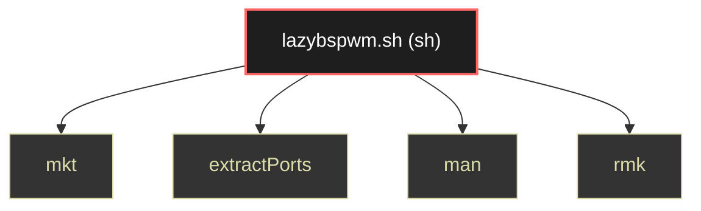

# Polyglot Codebase Knowledge Graph

> Generated offline by **readmenator**. 1 files, 4 symbols, 0 imports. Supports C, C++, Python, Go, Rust, JS/TS, Java, C#, Shell, PHP, Dart, GDScript, Nim, ASM, Ruby, Swift, Kotlin, Scala, Lua, Elixir.
> No LLMs. No tokens. Pure static analysis. See more [here](https://github.com/grisuno/ReadMenator)

**Start here:** Statistics Dashboard for scope, God Nodes for blast radius, Architecture Reference for per-file API. Agents: prefer `readmenator-agent/INDEX.md` + `SYMBOLS.md`.

**Total Files Parsed:** 1 | **Total Symbols Extracted:** 4 | **Total Imports:** 0

<!-- ranking_model: v1.0 | weights: {ppr:0.45,auth:0.2,test:0.15,doc:0.1,fresh:0.1} | alpha:0.85 | commit:b3ca3bb | date:2026-07-18 -->


## Table of Contents

1. [Statistics Dashboard](#statistics-dashboard)
2. [Architectural Layers](#architectural-layers)
3. [Ranked Context](#ranked-context)
4. [God Nodes](#god-nodes)
5. [Suggested Questions](#suggested-questions)
6. [Hotspot Analysis](#hotspot-analysis)
7. [Change Impact Analysis](#change-impact-analysis)
8. [Suggested Linting Rules](#suggested-linting-rules)
9. [Query Recipes](#query-recipes)
10. [Structural Knowledge Map](#structural-knowledge-map)
11. [UML Class Diagram](#uml-class-diagram)
12. [Code Property Graph](#code-property-graph)
13. [Architecture Reference](#architecture-reference)
    - [SH (1 files)](#sh-1-files)

---

## Statistics Dashboard

| Metric | Value |
|--------|-------|
| Total Files | 1 |
| Total Symbols | 4 |
| Total Imports | 0 |
| Call Edges | 0 |
| Inheritance Edges | 0 |
| Languages | 1 |
| Avg Symbols/File | 4.0 |
| Avg Imports/File | 0.0 |

---

## Architectural Layers

Auto-detected from path patterns, naming conventions, and imported frameworks.

| Layer | Files |
|-------|-------|
| utility | 1 |

### utility

- `lazybspwm.sh` (sh, 4 symbols)

---

## Ranked Context

Files ranked by composite score for the current query context. The ranking combines Personalized PageRank (query relevance), global authority, test coverage, documentation coverage, and code freshness. Model: v1.0.

| Rank | File | Composite | PPR | Authority | Test | Doc |
|------|------|-----------|-----|-----------|------|-----|
| 1 | `lazybspwm.sh` | 0.1000 | 0.0000 | 0.0000 | 0.00 | 1.00 |

---

## God Nodes

Most architecturally central files ranked by combined import/export degree and symbol richness.

| File | Score | Connections | PageRank |
|------|-------|-------------|----------|
| `lazybspwm.sh` | 0.4 | | 0.0000 |

---

## Suggested Questions

Auto-generated exploration prompts based on graph structure:

- What does lazybspwm.sh depend on, and what depends on it? (0 connections)
- What is the overall architecture of this codebase?

---

## Hotspot Analysis

Files ranked by combined complexity (symbol count) and centrality (connection count). High-scoring files are architecturally critical and may need refactoring attention.

| File | Complexity | Centrality | Combined | Symbols | Connections |
|------|-----------|------------|----------|---------|-------------|
| `lazybspwm.sh` | 1.000 | 0.000 | 0.400 | 4 | 0 |

---

## Change Impact Analysis

Files sorted by how many other files would be affected if they changed. High-impact files should be changed with caution.

| File | Direct Dependents | Transitive Dependents | Total Impact |
|------|------------------|----------------------|--------------|
| `lazybspwm.sh` | 0 | 0 | 0 |

---

## Suggested Linting Rules

Automatically suggested linting and security rules based on patterns detected in the codebase. These can be exported as Semgrep rules using the `--export-rules` flag.

| Rule ID | Severity | Description | Language | Matches |
|---------|----------|-------------|----------|---------|
| `RM001` | info | Large number of functions in sh: 4 total | sh | 4 |

---

## Query Recipes

Example queries you can run against this knowledge base using the ranking engine:

```
# Find files most relevant to a concept
readmenator query "Where is the import resolver implemented?"

# Rank files by relevance to a topic
readmenator query "How does documentation generation work?"

# Explain why a file ranks highly
readmenator query "explain readmenator/_documentation.py"

# Trace dependency paths with ranked context
readmenator query "path from CLI to exporter"
```

The ranking model uses the following signals:

- **Personalized PageRank** (45% weight): query-specific relevance via seed propagation
- **Global Authority** (20% weight): structural importance via standard PageRank
- **Test Coverage** (15% weight): fraction of symbols referenced in test files
- **Doc Coverage** (10% weight): presence of docstrings and file-level docs
- **Freshness** (10% weight): recent modification activity

Results include score decomposition and justification paths for each ranked item.

---

## Structural Knowledge Map



---

## Code Property Graph

Machine-readable Code Property Graph (CPG) in JSON-LD format. This block allows AI agents to parse the full structural graph without additional file reads. Compatible with GraphRAG pipelines.

```json
{"@context": "https://schema.org", "analysis": {"communities": [], "god_nodes": [{"node_id": "lazybspwm.sh", "score": 0.4}], "surprising_connections": []}, "edges": [], "generator": "readmenator", "metadata": {"edge_count": 0, "file_count": 1, "language_count": 1, "symbol_count": 4}, "nodes": [{"doc": "Paquetes necesarios", "id": "lazybspwm.sh", "kind": "module", "label": "lazybspwm.sh", "language": "sh", "sha256": "4ccd7bbde83fc40e", "symbol_count": 4, "symbols": [{"doc": "Functions", "kind": "function", "line": 305, "name": "mkt"}, {"doc": "Extract nmap information", "kind": "function", "line": 310, "name": "extractPorts"}, {"doc": "Set 'man' colors", "kind": "function", "line": 322, "name": "man"}, {"kind": "function", "line": 343, "name": "rmk"}]}], "type": "CodePropertyGraph", "version": "1.0"}
```

---

## Architecture Reference

### SH (1 files)

#### `lazybspwm.sh`
**Path:** `lazybspwm.sh`
**File Doc:** *Paquetes necesarios*

**Functions:**
- `mkt` (line 305) - *Functions*
- `extractPorts` (line 310) - *Extract nmap information*
- `man` (line 322) - *Set 'man' colors*
- `rmk` (line 343)
