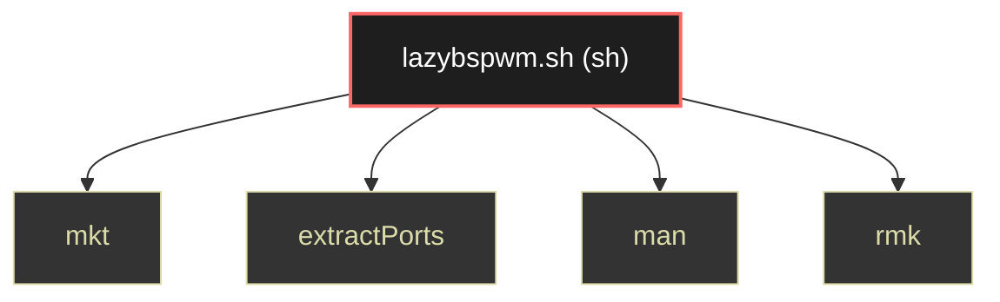

# Polyglot Codebase Knowledge Graph

> Generated offline by **readmenator**. Supports C, C++, Python, Go, Rust, JS/TS, Java, C#, Shell, PHP, Dart, GDScript, Nim, ASM.
> No LLMs. No tokens. Pure static analysis.

**Total Files Parsed:** 1 | **Total Symbols Extracted:** 4 | **Total Imports:** 0

## Structural Knowledge Map

---

## Architecture Reference

### SH (1 files)

#### `lazybspwm.sh`
**Path:** `lazybspwm.sh`

**Functions:**
- `mkt` (line 305) - *Functions*
- `extractPorts` (line 310) - *Extract nmap information*
- `man` (line 322) - *Set 'man' colors*
- `rmk` (line 343)
